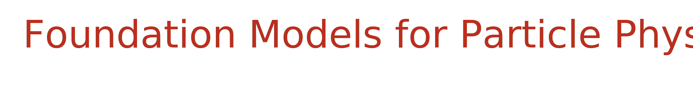

<!-- Replace this comment with your SVG title -->
<div align="center">
  
</div>

<div align="center">

[](https://python.org)
[](LICENSE)
[](https://tensorflow.org)
[](https://atlas.cern)


</div>

<br>

## Quick Start

```bash
# 1. Clone and setup environment
git clone https://github.com/Alezander9/hep-foundation
cd hep-foundation
uv venv --python 3.9
source .venv/bin/activate

# 2. Install package and dependencies
uv pip install -e .
uv sync --group dev
pre-commit install

# 3. Run test to verify installation
pytest tests/test_pipeline.py
# Check that test passes and results look good in _test_results/

# 4. Run real experiment
cp tests/_test_pipeline_config.yaml _experiment_config_stack/
python scripts/run_pipelines.py
# Results will appear in _foundation_experiments/
```

---

## Usage

### Pipeline Overview

The HEP Foundation pipeline is designed as a simple workflow:

1. **Create configs** → Put YAML configuration files in `_experiment_config_stack/`
2. **Run pipeline** → Execute `python scripts/run_pipelines.py` 
3. **Get results** → Find experiment results in `_foundation_experiments/`

Use `tests/_test_pipeline_config.yaml` as a template - just modify the values for your experiments. The pipeline processes all configs in the stack and removes them as it completes each one.

### Results

Each experiment produces a complete folder in `_foundation_experiments/` containing:

- **Training results** - Model weights, training history, and plots
- **Regression evaluation** - Data efficiency comparison across model types  
- **Signal classification** - Binary classification performance analysis
- **Anomaly detection** - Background vs signal discrimination metrics
- **Reproducibility** - Copy of original config and experiment metadata

The pipeline automatically runs the full sequence: foundation model training → regression → signal classification → anomaly detection.

## System Requirements

### Performance Expectations

- **Dataset size**: Typically O(1M) events per dataset
- **Training speed**: ~15 seconds per epoch on NERSC A100 GPU  
- **GPU requirement**: Strongly recommended for training (CPU training is very slow)

### Recommended Workflow

<details>
<summary><strong>For NERSC users</strong></summary>

1. **Create datasets locally** - The pipeline is bottlenecked by downloading ROOT files from CERN OpenData, so run data creation on your local machine:
   ```bash
   python scripts/create_datasets.py  # Creates datasets without deleting configs
   ```

2. **Transfer to NERSC** - Use provided transfer utilities:
   ```bash
   python scripts/transfer_configs.py    # Transfer config files
   python scripts/transfer_datasets.py  # Transfer dataset files  
   ```
   (Requires environment variables and SSH key setup)

3. **Run training on cluster**:
   ```bash
   sbatch jobs/submit_pipeline_simple.sh
   ```

</details>

**For local development:** Just run the pipeline directly as seen in the Quick Start setup.

## Project Structure

### Key Directories

```
src/hep_foundation/          # Main package source code
├── config/                  # Configuration loading and validation
├── data/                    # Dataset management, PhysLite data system
├── models/                  # Model architectures (VAE, DNN, etc.)
├── training/                # ModelTrainer and training utilities
└── utils/                   # Plotting, logging, and utility functions

scripts/                     # Execution and utility scripts
├── run_pipelines.py         # Main pipeline runner
├── create_datasets.py       # Local dataset creation
└── transfer_*.py            # Remote transfer utilities

tests/                       # Test suite and test configurations
jobs/                        # SLURM job submission scripts
logs/                        # Pipeline execution logs

_experiment_config_stack/    # Input: YAML configs to process
_foundation_experiments/     # Output: Experiment results
_processed_datasets/         # Cached datasets (HDF5 files)
_test_results/              # Test outputs (cleaned each run)
```

### Configuration Files

**Creating configs:** Use `tests/_test_pipeline_config.yaml` as a template for your experiments.

**Key configuration sections:**
- `dataset`: Data selection (ATLAS run numbers, signal types)
- `models`: VAE and DNN architectures  
- `training`: Training parameters (epochs, batch size, learning rate)
- `evaluation`: Data sizes for efficiency studies

**PhysLite features:** Specify any PhysLite branch names in the config. Derived features (eta, pt, etc.) are automatically calculated from base branches using `physlite_derived_features.py`.

### Understanding Results

Each experiment folder contains:

```
001_Foundation_VAE_Model/
├── _experiment_config.yaml     # Reproducible config copy
├── _experiment_info.json       # Experiment metadata
├── models/foundation_model/    # Saved model weights
├── training/                   # Training metrics and plots
└── testing/
    ├── regression_evaluation/      # Data efficiency: regression tasks
    ├── signal_classification/      # Data efficiency: classification  
    └── anomaly_detection/          # Background vs signal scoring
```

**Key output files:**
- Training plots and metrics in `training/`
- Data efficiency plots comparing foundation model benefits in `testing/*/`
- Model weights for reuse in `models/foundation_model/`

### Development Utilities

**Code quality:**
- `.pre-commit-config.yaml` - Automated code formatting (ruff) and quality checks
- `uv` package management with `pyproject.toml` configuration

**Development tools:**
- `.devcontainer/` - Docker container for consistent development environment
- `scripts/test_gpu.py` - Verify TensorFlow GPU access on your system
- `src/hep_foundation/utils/plot_utils.py` - Standardized colors, fonts, and styling for all plots

---

## Citation

<div align="center">

**If you use this software in your research, please cite:**

</div>

```
Yue, A. (2024). HEP Foundation: Foundation models for High Energy Physics data analysis. 
https://github.com/Alezander9/hep-foundation
```

<details>
<summary>BibTeX Format</summary>

```bibtex
@software{yue_hep_foundation_2024,
  author = {Yue, Alexander},
  title = {HEP Foundation: Foundation models for High Energy Physics data analysis},
  url = {https://github.com/Alezander9/hep-foundation},
  year = {2024}
}
```

</details>

<div align="center">
<em>Note: A research paper is in preparation. This citation will be updated when published.</em>
</div>

---

## License

<div align="center">

This project is licensed under the **MIT License** - see the [LICENSE](LICENSE) file for details.

</div>

## Contact

<div align="center">

**Questions or issues?**  

Email: [alexyue@stanford.edu](mailto:alexyue@stanford.edu)  
GitHub: [Alezander9/hep-foundation](https://github.com/Alezander9/hep-foundation)

</div>
